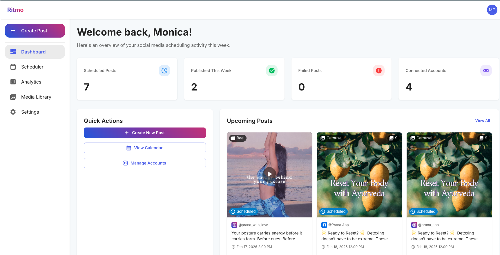
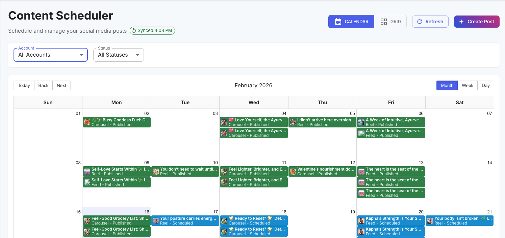
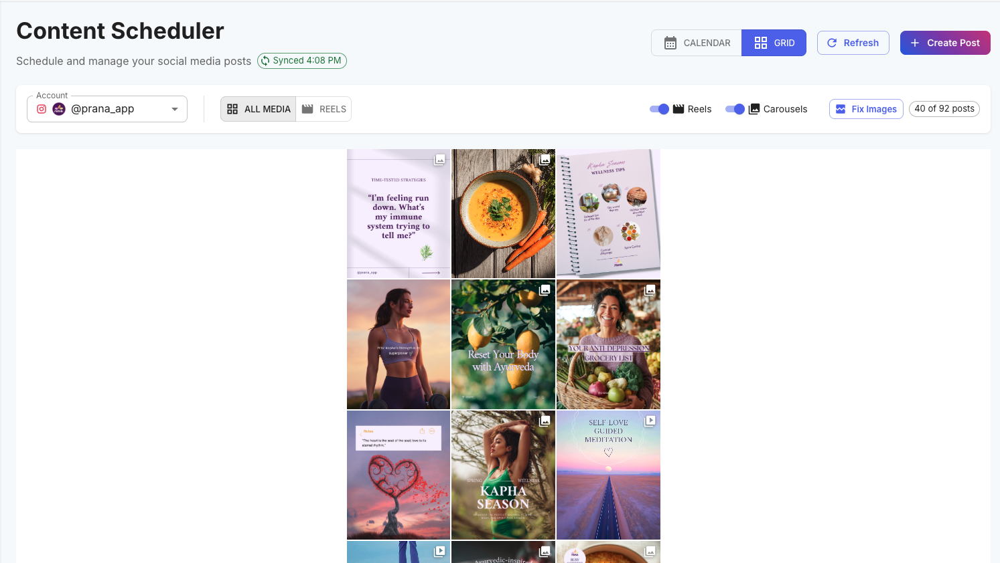
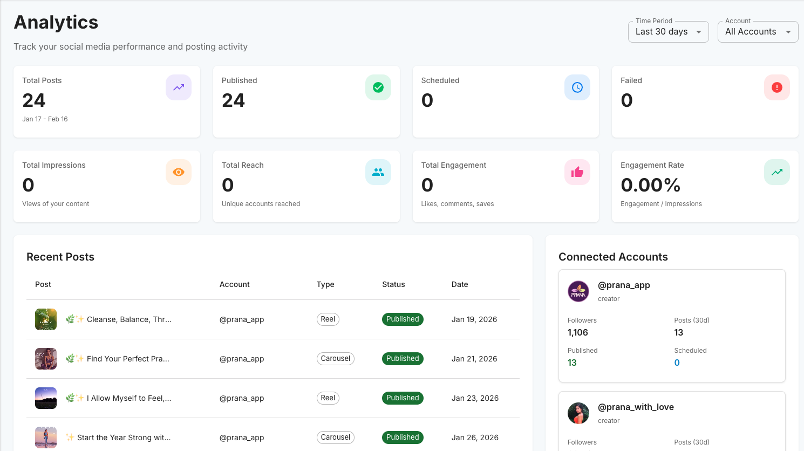

# Social Media Scheduler

Social Media Scheduler is a multi-platform publishing and content planning app for creators, brands, and small teams. It provides a unified workflow to draft content, manage media, schedule posts, publish to connected channels, and monitor performance.

The app currently supports platform integrations for Instagram, Facebook, and Pinterest, with Supabase powering auth, data, storage, and serverless backend workflows.

## The Problem

Most social workflows are fragmented across tools:

- Content ideas are tracked in one place, media in another.
- Scheduling lacks a visual workflow for feed consistency.
- Publishing logic is tightly coupled to platform-specific APIs.
- Token refresh, retries, and insight collection are often manual.

This increases overhead and makes reliable cross-platform publishing hard to scale.

## The Solution

Social Media Scheduler centralizes the content lifecycle end-to-end:

1. Connect social accounts (Instagram/Facebook/Pinterest).
2. Create posts with media, captions, hashtags, and post type configuration.
3. Plan visually using Calendar and Grid views.
4. Schedule or publish immediately through backend functions.
5. Track account/post performance through built-in insights.

## Screenshots

### Dashboard



### Calendar View



### Grid Planner



### Analytics



## Core Features

### 1) Multi-View Scheduling

- Calendar planning across month/week/day views.
- Rich event cards and post details modal.
- Visual timeline for upcoming, published, and failed posts.

### 2) Grid-Based Content Planning

- Instagram-style layout for feed planning.
- Drag-and-drop reordering for scheduled posts.
- Filtering and organization tools for content blocks.

### 3) Advanced Post Composer

- Support for feed, story, reel, and carousel workflows.
- Media upload and selection from the internal media library.
- Image cropping and reel cover selection.
- AI-assisted caption and hashtag generation.

### 4) Media Library

- Private media storage with signed URL delivery.
- Upload/remove flows with metadata persisted in Postgres.
- Reusable media assets across post drafts and schedules.

### 5) Platform Integrations

- OAuth token exchange + refresh flows via Supabase Edge Functions.
- Platform-specific publish handlers for Instagram/Facebook/Pinterest.
- Connection validation utilities and mirrored media refresh flows.

### 6) Insights & Analytics

- Account-level insight retrieval.
- Post-level performance metrics.
- Analytics page for social reporting workflows.

## Tech Stack

### Frontend

| Technology | Purpose |
| --- | --- |
| React 19 + Vite | Fast SPA development with HMR and optimized builds |
| TypeScript | End-to-end type safety across components, hooks, and services |
| MUI | UI component system and design primitives |
| react-big-calendar | Calendar rendering and scheduling UX |
| @hello-pangea/dnd | Drag-and-drop interactions in grid planning |

### Backend & Data

| Technology | Purpose |
| --- | --- |
| Supabase (Postgres/Auth/Storage) | Core persistence, auth, and media storage |
| Supabase Edge Functions | Serverless functions for auth exchange, publish, refresh, insights |
| Bunny CDN/Storage integration | Upload and delivery support for media workflows |

### AI

| Technology | Purpose |
| --- | --- |
| Google Gemini API | Caption + hashtag generation for post drafting |

## Architecture Overview

### Request Flow

- React client triggers actions through typed hooks/services.
- Data operations are stored in Supabase Postgres.
- Media operations flow through private storage + signed URLs.
- Publishing and analytics run through Edge Functions.

### Edge Function Responsibilities

- Token exchange/refresh for connected platforms.
- Scheduled publish execution and immediate publish actions.
- Insights retrieval for account and post analytics.
- Media upload URL generation and cleanup utilities.

## Project Structure

```
src/
├── components/
│   ├── auth/                # Login/signup UIs
│   ├── calendar/            # Calendar rendering and interactions
│   ├── grid/                # Grid planner + filtering
│   ├── instagram/           # Instagram account connectivity UI
│   ├── facebook/            # Facebook page connection UI
│   ├── pinterest/           # Pinterest account connection UI
│   ├── posts/               # Composer, modal, uploader, cropper, reel cover tools
│   └── layout/              # Navbar and sidebar shell
├── hooks/                   # Data/state hooks for auth, posts, media, integrations
├── pages/                   # Dashboard, Scheduler, Analytics, Settings, Media Library
├── services/                # API wrappers (AI, analytics, posts, media, platform services)
├── contexts/                # Auth context
├── config/                  # Supabase/Bunny client configuration
└── utils/                   # Grid helper utilities

supabase/
├── migrations/              # Schema migrations
└── functions/               # Edge functions for publish, refresh, insights, media
```

## Setup Instructions

### Prerequisites

- Node.js 18+
- npm 9+
- A Supabase project
- (Optional) Google Gemini API key

### Environment Variables

Create a `.env` file at the project root:

```bash
VITE_SUPABASE_URL=your-supabase-url
VITE_SUPABASE_ANON_KEY=your-supabase-anon-key
VITE_GEMINI_API_KEY=your-gemini-api-key
VITE_GEMINI_MODEL=gemini-2.5-flash
```

### Database & Storage Setup

1. Apply migrations from `supabase/migrations` (starting with `001_initial_schema.sql`).
2. Create a private storage bucket named `media`.
3. Ensure signed URL access is enabled in your media retrieval flows.

### Edge Functions Setup

Deploy required functions used by the app, including:

- `publish-post-now`
- `scheduled-publisher`
- `refresh-instagram-token`
- `refresh-pinterest-token`
- `get-account-insights`
- `get-facebook-insights`
- `get-post-insights`
- `validate-instagram-connection`
- `get-upload-url`
- `upload-media`
- `delete-media`

### Install and Run

```bash
npm install
npm run dev
```

## Available Scripts

| Script | Description |
| --- | --- |
| `npm run dev` | Start Vite development server |
| `npm run build` | Build production assets |
| `npm run preview` | Preview production build |
| `npm run lint` | Run ESLint checks |

## Usage Workflow

1. Connect your social account(s).
2. Upload or select media assets.
3. Compose post content and choose post type.
4. Schedule time/date and review in calendar or grid.
5. Publish now or let scheduled jobs process automatically.
6. Monitor insights from analytics views.

## Data Model (High Level)

Core entities include:

- Users/auth profiles
- Connected social accounts
- Scheduled posts
- Media library assets

See the SQL files under `supabase/migrations` for exact schema definitions.

## Engineering Notes

- TypeScript is used across frontend and Edge Functions for consistency.
- Integration logic is abstracted into dedicated hooks/services by platform.
- Private media access is enforced through signed URL patterns.
- Scheduler/publisher flows are designed to be extensible for additional platforms.

## License

This project is licensed under the MIT License. See [LICENSE](LICENSE) for details.
